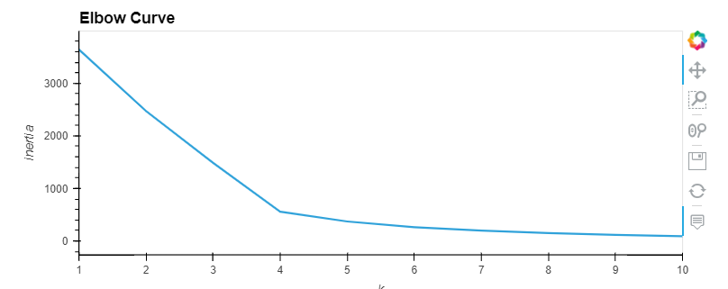
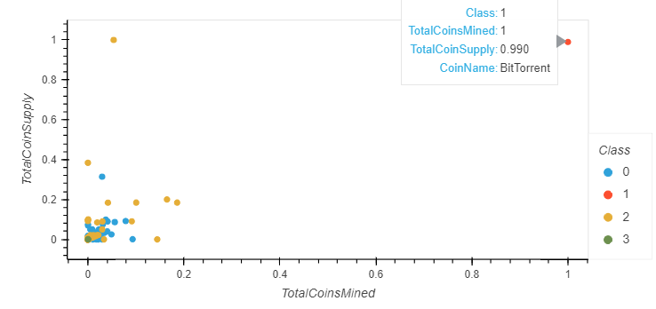

# Cryptocurrencies

## Purpose
The purpose of this analysis was to use the cryptocurrency data and evaluate it using PCA, KMeans. 
Then visualization were created using hvplot.

## Results

Once the PCA components were created they were used to fit the KMeans. 
This elbow curve was created, showing that 4 dimensions is most optimal

Once the KMeans model was initialized, fit, and clusters were predicted, this 3D visualization was created to represent the crypto groupings.

Of the 532 tradable cryptocurrencies, this scatter plot visualizes that 'Total Coin Supply' against 'Total Coins Mined'.

